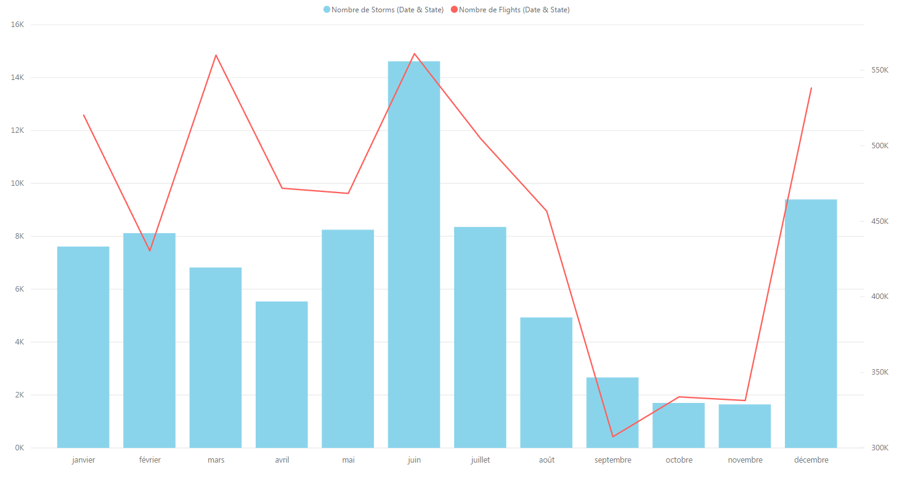
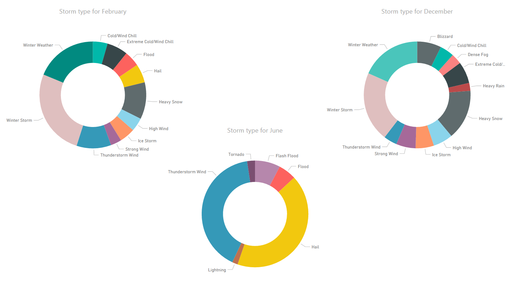

# Final report - What type of weather causes flights to be late?

## Introduction

As I am a person that travels by air fairly often and was thinking of planing a trip around the USA I was wanting to see what might influence travels.

An important peace of information I was wanting to know was, what type of weather can cause flights to be late. 
While I was at it I can also confirmed whether the weather has an impact on flights being late.

## Methods

### Where I got the data

As the trip I'm going to plan is in the USA, which is a big place, I will traveling by plane quite a bit. So I needed information on past flights, the weather condition on those days and a list of all the US states, just in case.

The data I wanted was eventually found on three different sites:

- [Statistical Computing - Statistical Graphics][d4f89e07] (Flights)
- [Statistical Computing - Statistical Graphics][ba858708] (Airports)
- [National Centers for Environmental Information][0800d6c6] (Storms)
- [GitHub - List-of-US-States][a4529059] (States)

### Data transformation

So that I could use the data and create some nice charts I needed to clean/tidy up the data. 
For that three methods where used:

- Ruby scripts: They where used to format the data, remove the unwanted columns & rows and even combine some rows.
- Manual editing: Not much just remove the header/first line in the files after the scripts where used.
- MySQL database: Was used because it was the easiest way I knew of combining rows and adding unique identifiers.

## Results

To answer my question I first checked that storms had an impact on flights. 
The following chart demonstrates this quite well.

| Number of storms compared to the number of delayed flights
| ----------------------------------------------------------------------------------------------------------------
| 

I found three interesting points in this chart that I wanted to investigate in more in detail.

1. Why were there a lot of delay in March but not too may storms?
2. What happened in June?
3. Why does it suddenly jump back up in December?

With the following three charts I could see what caused this to happened.

| Storm types for specific months
| --------------------------------------------------------------------------------------------
| 

From these charts we can see that the winter weathers (storm, snow and weather) has a lot of influence on flight delays. 
For the month of June there was a very surprising amount of hail and thunderstorm winds which seemed to have a big impact on flights.

With is we can answer our original question `What type of weather causes flights to be late?`.

## Conclusions

Like I originally thought the weather clearly influences if a flight will be delayed. This was not a surprise as you hear it on the news all the time when there are storms. 
Unfortunately, we can not see by how much the delay was. If the delay was only a couple of minutes this wouldn't really matter but if the delay was a couple of hours then that's a problem.

I now also know that I should find another mode of transportation during the winter or hunker down in some town. June was a surprising discovery, but need more investigating to find out if it is something that happens every year or not.

 The data that analyzed was only for the year 2008, that was 10 years ago and things might have changed. Finally, the USA is vast and in this analyses I compared the hole of the USA at the same time. I would need to check these same charts but by state.

[0800d6c6]: https://www.ncdc.noaa.gov/stormevents/ftp.jsp "Storms"
[a4529059]: https://github.com/jasonong/List-of-US-States/blob/master/states.csv "States"
[ba858708]: http://stat-computing.org/dataexpo/2009/supplemental-data.html "Airports"
[d4f89e07]: http://stat-computing.org/dataexpo/2009/the-data.html "Flights"
